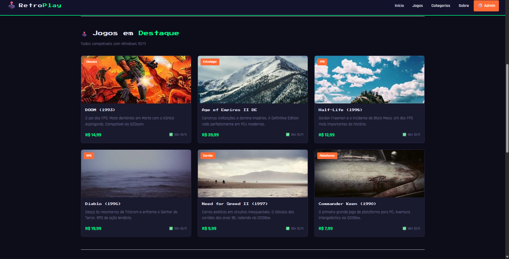
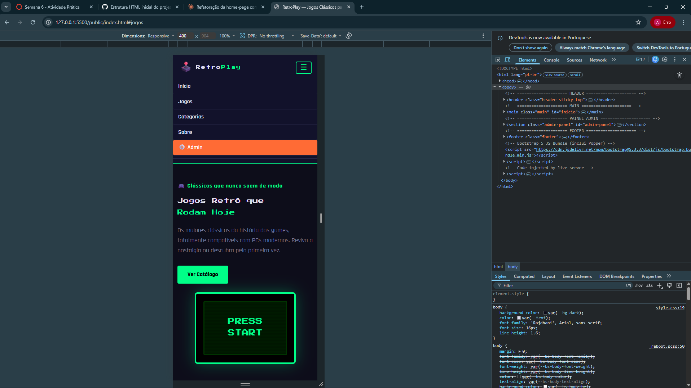
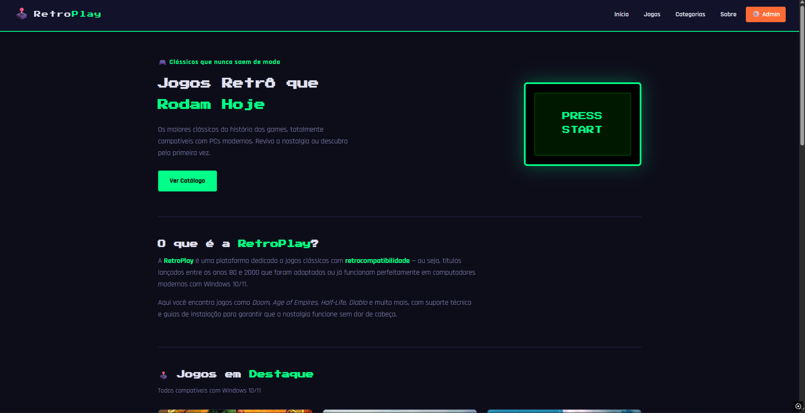
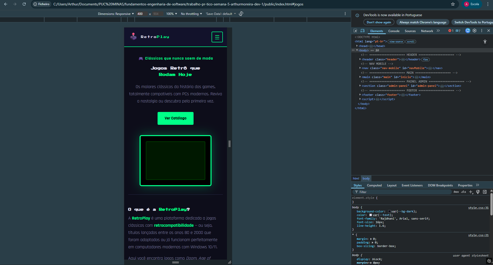

# Trabalho Prático - Semana 6
Nessa atividade, como sempre, vamos evoluir o que foi feito na semana anterior. Fique atento para fazer o projeto da semana anterior e dar sequência nessa jornada.
No trabalho dessa semana vamos alterar o projeto para que a responsividade da home-page seja feita, agora, com o framework Bootstrap.
**IMPORTANTE 1:** Você deve alterar apenas os arquivos **`README.md`**, **`index.html`** e **`styles.css`**, podendo incluir outros arquivos como imagens na pasta **`images`**, caso necessário. Deixe todos os demais arquivos e pastas desse repositório inalterados. **PRESTE MUITA ATENÇÃO NISSO.**
# Trabalho Prático - Semana 5
## Informações Gerais
- **Nome:** Arthur Moreira Figueiredo
- **Matrícula:** 909477
- **Proposta de projeto escolhida:** Site para venda de jogos
- **Breve descrição sobre seu projeto:** Site estilo Steam onde são vendidos jogos com retrocompatibilidade — jogos antigos que funcionam em PCs modernos com Windows 10/11.

## Print da versão responsiva com Bootstrap [DESKTOP]

## Print da versão responsiva com Bootstrap [MOBILE] (*)

## Print da versão responsiva com CSS puro [DESKTOP]

## Print da versão responsiva com CSS puro [MOBILE]

(*) Utilize as ferramentas do desenvolvedor do seu navegador para colocar no modo responsivo, escolha um celular qualquer e recarregue a página antes de tirar o print.